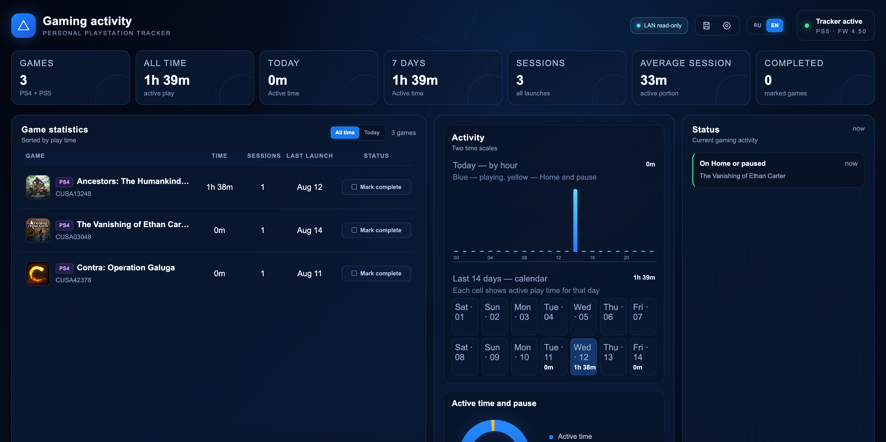

# Playlog / PS5 Activity Tracker
<p align="center">
  
</p>
[Русская версия](README.ru.md)


Playlog is a local activity tracker for a hacked PS5. It works without PSN or
external services: the runtime reads system events, measures play and pause
time, and the dashboard presents the statistics on the console.

Current stable release: **1.3.0**.

The PKG keeps its monotonic internal installer metadata (`01.070.000`) so it
can be installed over the tested
runtime versions; do not lower or rewrite that value when uploading the asset.

> Known operational limitations remain;
> read [KNOWN_LIMITATIONS.md](KNOWN_LIMITATIONS.md) before installing it.

## Features

- PS4 (`CUSA...`) and PS5 (`PPSA...`) games;
- active time, Home/pause time, sessions and today/week/month periods;
- best-effort game-title and local-cover lookup from system metadata;
- reversible “Completed” marks;
- CRC-protected primary state and a previous state generation;
- dashboard backup and restore;
- RU/EN dashboard compatible with the older embedded browser;
- read-only LAN viewing from a computer or phone;
- a separate game-library page with current installed titles first and a
  second catalog section for titles present in the system registry but no
  longer present on the console filesystem;
- offline carrier updates delivered by a newer PKG.

## Architecture

```text
Media PKG ACTV00002 -> tile + dashboard/carrier
Playlog.elf         -> first-run setup and runtime
etaHEN or SM+/PLK  -> runtime autostart after restart
HTTP :12888         -> local dashboard and API
```

The main page remains the existing statistics view. The separate library page
is served by the same runtime and reads the current game registry from
`app.db`. It accepts CUSA/PPSA rows regardless of firmware-specific
`categoryType` values, while known media/system applications and DLC are
omitted. If the registry cannot be read, supported internal, external and
portable-game directories are scanned as a fallback. It does not alter the
tracker state or the main page layout.

The Media PKG does not launch the ELF or write to `/data` by itself. After
installing the PKG, launch `Playlog.elf` once through USB/loader and select the
autostart method in the dashboard.

## Installation

1. Download the PKG and `Playlog.elf` from the GitHub Release.
2. Install the PKG with Title ID `ACTV00002`.
3. Launch `Playlog.elf` once through USB/etaHEN Toolbox or a loader on port
   `9021`. The runtime waits five seconds before setup.
4. Open the Playlog tile on the console.
5. Select `etaHEN` or `ShadowMount+ / PLK`.
6. Restart the selected runtime or the console.

Created paths:

```text
/data/etaHEN/plugins/Playlog.elf
/data/etaHEN/plugins/Playlog.elf.auto_start
/data/ps5_autoloader/Playlog.elf
/data/ps5_autoloader/autoload.txt (modified only when a payload chain exists)
/data/ps5-activity/
```

Use only one autostart method. Do not run the ELF together with an older
`.plugin`.

In `ShadowMount+ / PLK` mode Playlog never creates `autoload.txt`. If the file
is missing, empty, or contains only comments, delays and directives, it is
left unchanged and the setup page displays a manual configuration message.
This preserves the built-in Payload Manager fallback used by BD-JB, Y2JB, Lua
and Unified Autoloader chains.

When an existing `autoload.txt` already contains another payload, Playlog adds
`!5000` and `Playlog.elf` at the end. If Playlog is already listed, the entire
file and the user's chosen launch order are left unchanged. A file containing
only Playlog is also preserved but reported as requiring manual setup. Payload
Manager users should enable Playlog in PLK itself.

## Dashboard and LAN

On the console, open the Playlog tile. It uses:

```text
http://127.0.0.1:12888/
```

Use the library icon in the header, or open `/library.html`, to see current
filesystem-backed titles first and older entries from the system registry
below. A row can remain in `/system_data/priv/mms/app.db` after its files are
removed, so the runtime checks content roots before setting `installed`.
The persistent `appmeta` metadata cache is not proof of an installed title;
ShadowMount+ mount links under `/user/app/<TITLE_ID>` are recognized. This
catalog is independent of Playlog activity; it can
therefore show games used before Playlog was installed. DLC from `addcont.db`
is intentionally not shown yet.

A leftover `/user/app/<TITLE_ID>` staging directory that contains only
`sce_sys/param.sfo` or `param.json` is also treated as removed: metadata alone
does not make a portable image live. A valid content root must expose
`eboot.bin`/`app.pkg`, or a `mount.lnk` whose target still exists.

If the library is empty, the API response includes `source`,
`database_status` and `database_rows` so a diagnostic report can distinguish a
truly empty registry from a locked or unavailable database.

From a computer or phone on the trusted local network:

```text
http://<PS5_IP>:12888/
```

LAN clients are read-only, but they can still read game history and session
times. Do not forward the port to the Internet or expose it to an untrusted
network. The current server has no authentication.

## Console data

```text
/data/ps5-activity/summary.json
/data/ps5-activity/tracker-state.bin
/data/ps5-activity/tracker-state.prev.bin
/data/ps5-activity/completed-state.bin
/data/ps5-activity/config.json
/data/ps5-activity/backups/
/data/ps5-activity/covers/
```

History is not part of the PKG and must not be committed to Git. Create a
dashboard backup before an update or a test session.

## Updates

1. Install the newer PKG over `ACTV00002`.
2. Open the dashboard.
3. Press offline update and confirm.
4. Wait for the automatic-backup and carrier-application messages.
5. Restart the runtime when the dashboard asks you to.

The dashboard creates an automatic backup before applying an update. The
updater writes all discovered etaHEN, PLK/ShadowMount+ and USB-autoloader
runtime copies, and only records the carrier as applied after a runtime target
was successfully written. Keep a separate copy of `/data/ps5-activity` for
recovery from power loss or unstable exploit/runtime conditions.

## Building from source

The ELF requires the PS5 Payload SDK, `prospero-clang` and the static
`ps5-payload-sqlite` package (the package installs `sqlite3.h` and
`libsqlite3.a` under `/user/homebrew`):

```bash
cd activity-probe
PS5_PAYLOAD_SDK=/path/to/ps5-payload-sdk make
```

Build/install the SQLite package from the PS5 Payload pacbrew repository into
the SDK before running this command. Override `SQLITE_PREFIX` if it is kept in
a different sysroot location.

The Media PKG requires LibProsperoPKG and Docker for linux/arm64:

```bash
cd release-build
make
```

The builder must finish with `Accepted: True`. Generated ELF/PKG files are not
committed to the source tree; upload them as GitHub Release Assets.

## Checks

```bash
python3 -m unittest discover -s tests -v
python3 tools/check_public_tree.py
node --check release-build/build-carrier.js
```

## Compatibility

The primary hardware test was performed on firmware 4.50. Foreground session
tracking through `SceShellCoreUtilAppFocus` was also user-validated on firmware
11.60 with ShadowMount+/PLK. Other runtime combinations must be verified
separately.

## Documentation

- [KNOWN_LIMITATIONS.md](KNOWN_LIMITATIONS.md) — known operational limitations;
- [docs/PORTING_MANIFEST.md](docs/PORTING_MANIFEST.md) — architecture and boundaries;
- [docs/COMPATIBILITY.md](docs/COMPATIBILITY.md) — tested firmware matrix;
- [SECURITY.md](SECURITY.md) — LAN privacy and vulnerability reporting.
